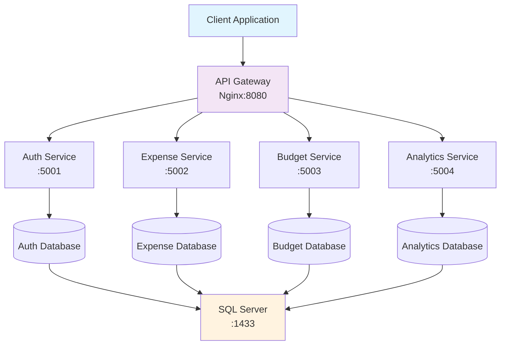

# SpendWise

[](https://dotnet.microsoft.com/)
[](https://www.docker.com/)
[](LICENSE)
[]()

A modern, microservices-based personal finance platform built with .NET 9.0, featuring robust authentication, comprehensive expense management, and advanced analytics capabilities.

## Table of Contents

- [Features](#features)
- [Architecture](#architecture)
- [Quick Start](#quick-start)
- [API Documentation](#api-documentation)
- [Development](#development)
- [Deployment](#deployment)
- [Documentation](#documentation)
- [Contributing](#contributing)
- [Troubleshooting](#troubleshooting)

## Features

### Core Functionality

- **User Authentication**: Secure registration and login with JWT.
- **Expense Management**: Create, read, update, and delete expenses.
- **Budgeting**: Set budgets and track spending against them.
- **Analytics**: Visual dashboards and financial health summaries.

### Technical Features

- **Microservices Architecture**: Decoupled services for scalability.
- **API Gateway**: Centralized entry point using Nginx.
- **Containerization**: Fully dockerized for easy deployment.
- **Modern Stack**: Built with .NET 9.0 and SQL Server.

## Architecture



### Service Overview

| Service               | Port | Responsibility                  | Database                |
| --------------------- | ---- | ------------------------------- | ----------------------- |
| **API Gateway**       | 8080 | Request routing, load balancing | -                       |
| **Auth Service**      | 5001 | Authentication, user management | ExpenseTrackerAuth      |
| **Expense Service**   | 5002 | Expense CRUD operations         | ExpenseTrackerExpenses  |
| **Budget Service**    | 5003 | Budget management, alerts       | ExpenseTrackerBudgets   |
| **Analytics Service** | 5004 | Financial analytics, reporting  | ExpenseTrackerAnalytics |
| **SQL Server**        | 1433 | Database server                 | Multiple databases      |

## Quick Start

### Prerequisites

- [Docker Desktop](https://www.docker.com/products/docker-desktop)
- [Git](https://git-scm.com/)
- [.NET 9.0 SDK](https://dotnet.microsoft.com/download/dotnet/9.0) (optional, for local dev)

### Installation

1. **Clone the repository**

   ```bash
   git clone https://github.com/your-username/ExpenseTracker.git
   cd ExpenseTracker
   ```

2. **Start all services**

   ```bash
   docker-compose up --build -d
   ```

3. **Verify deployment**

   ```bash
   # Check service health
   curl http://localhost:8080/health

   # View service status
   docker-compose ps
   ```

4. **Access the application**
   - API Gateway: http://localhost:8080
   - Auth Service: http://localhost:8080/auth/swagger
   - Expense Service: http://localhost:8080/expense/swagger
   - Budget Service: http://localhost:8080/budget/swagger
   - Analytics Service: http://localhost:8080/analytics/swagger

### First Run

1. **Register a new user**

   ```bash
   curl -X POST http://localhost:8080/api/auth/register \
     -H "Content-Type: application/json" \
     -d '{
       "username": "demo_user",
       "email": "demo@example.com",
       "password": "SecurePassword123!"
     }'
   ```

2. **Login and get JWT token**

   ```bash
   curl -X POST http://localhost:8080/api/auth/login \
     -H "Content-Type: application/json" \
     -d '{
       "email": "demo@example.com",
       "password": "SecurePassword123!"
     }'
   ```

3. **Create your first expense**
   ```bash
   curl -X POST http://localhost:8080/api/expense \
     -H "Content-Type: application/json" \
     -H "Authorization: Bearer YOUR_JWT_TOKEN" \
     -d '{
       "description": "Coffee",
       "amount": 4.50,
       "category": "Food & Drink",
       "date": "2025-10-10T10:30:00Z"
     }'
   ```

## 📚 API Documentation

### Authentication Endpoints

| Method | Endpoint             | Description       | Auth Required |
| ------ | -------------------- | ----------------- | ------------- |
| POST   | `/api/auth/register` | Register new user | ❌            |
| POST   | `/api/auth/login`    | User login        | ❌            |
| GET    | `/api/auth/profile`  | Get user profile  | ✅            |
| PUT    | `/api/auth/profile`  | Update profile    | ✅            |
| POST   | `/api/auth/refresh`  | Refresh JWT token | ✅            |

### Expense Management

| Method | Endpoint                  | Description            | Auth Required |
| ------ | ------------------------- | ---------------------- | ------------- |
| GET    | `/api/expense`            | List user expenses     | ✅            |
| POST   | `/api/expense`            | Create new expense     | ✅            |
| GET    | `/api/expense/{id}`       | Get expense details    | ✅            |
| PUT    | `/api/expense/{id}`       | Update expense         | ✅            |
| DELETE | `/api/expense/{id}`       | Delete expense         | ✅            |
| GET    | `/api/expense/categories` | Get expense categories | ✅            |

### Budget Management

| Method | Endpoint                  | Description        | Auth Required |
| ------ | ------------------------- | ------------------ | ------------- |
| GET    | `/api/budget`             | List user budgets  | ✅            |
| POST   | `/api/budget`             | Create budget      | ✅            |
| GET    | `/api/budget/{id}`        | Get budget details | ✅            |
| PUT    | `/api/budget/{id}`        | Update budget      | ✅            |
| DELETE | `/api/budget/{id}`        | Delete budget      | ✅            |
| GET    | `/api/budget/{id}/status` | Get budget status  | ✅            |

### Analytics & Reporting

| Method | Endpoint                       | Description         | Auth Required |
| ------ | ------------------------------ | ------------------- | ------------- |
| GET    | `/api/analytics/dashboard`     | Financial dashboard | ✅            |
| GET    | `/api/analytics/summary`       | Expense summary     | ✅            |
| GET    | `/api/analytics/categories`    | Category breakdown  | ✅            |
| GET    | `/api/analytics/trends`        | Spending trends     | ✅            |
| GET    | `/api/analytics/health-status` | Financial health    | ✅            |

### Interactive Documentation

Access comprehensive API documentation with interactive testing:

## 🛠️ Development

### Local Development Setup

1. **Install .NET 9.0 SDK**

   ```bash
   # macOS (using Homebrew)
   brew install dotnet

   # Windows (using Chocolatey)
   choco install dotnet-9.0-sdk

   # Or download from: https://dotnet.microsoft.com/download
   ```

2. **Start dependencies**

   ```bash
   # Start only database
   docker-compose up sqlserver -d
   ```

3. **Run services locally**

   ```bash
   # Auth Service
   cd Backend/AuthService
   dotnet run

   # Expense Service
   cd Backend/ExpenseService
   dotnet run

   # Budget Service
   cd Backend/BudgetService
   dotnet run

   # Analytics Service
   cd Backend/AnalyticsService
   dotnet run
   ```

### Project Structure

```
ExpenseTracker/
├── Backend/                    # .NET microservices
│   ├── AuthService/           # Authentication service
│   ├── ExpenseService/        # Expense management
│   ├── BudgetService/         # Budget management
│   ├── AnalyticsService/      # Analytics & reporting
│   └── Backend.sln            # Solution file
├── Gateway/                   # Nginx configuration
├── Tests/                     # Test projects
├── Docs/                      # Documentation
├── Scripts/                   # Deployment scripts
├── docker-compose.yml         # Container orchestration
├── docker-compose.override.yml # Development overrides
└── README.md                  # This file
```

### Testing

```bash
# Run all tests
dotnet test Backend/Backend.sln

# Run tests with coverage
dotnet test --collect:"XPlat Code Coverage"

# Run specific service tests
dotnet test Backend/AuthService.Tests/
dotnet test Backend/ExpenseService.Tests/
dotnet test Backend/BudgetService.Tests/
dotnet test Backend/AnalyticsService.Tests/
```

### Code Quality

```bash
# Format code
dotnet format Backend/Backend.sln

# Static analysis
dotnet build --verbosity normal
```

## 🚀 Deployment

### Production Deployment

1. **Environment Configuration**

   ```bash
   # Copy and customize environment file
   cp .env.example .env

   # Edit configuration
   vim .env
   ```

2. **Production Build**

   ```bash
   # Build for production
   docker-compose -f docker-compose.yml -f docker-compose.prod.yml build

   # Deploy
   docker-compose -f docker-compose.yml -f docker-compose.prod.yml up -d
   ```

### Environment Variables

| Variable                 | Description            | Default              | Required |
| ------------------------ | ---------------------- | -------------------- | -------- |
| `DB_PASSWORD`            | SQL Server password    | `ExpenseTracker123!` | ✅       |
| `JWT_SECRET`             | JWT signing key        | Generated            | ✅       |
| `ASPNETCORE_ENVIRONMENT` | Environment            | `Development`        | ✅       |
| `AUTH_SERVICE_PORT`      | Auth service port      | `5001`               | ❌       |
| `EXPENSE_SERVICE_PORT`   | Expense service port   | `5002`               | ❌       |
| `BUDGET_SERVICE_PORT`    | Budget service port    | `5003`               | ❌       |
| `ANALYTICS_SERVICE_PORT` | Analytics service port | `5004`               | ❌       |
| `GATEWAY_PORT`           | API Gateway port       | `8080`               | ❌       |

### Health Checks

Monitor service health using built-in endpoints:

```bash
# Overall system health
curl http://localhost:8080/health

# Individual service health
curl http://localhost:5001/health  # Auth Service
curl http://localhost:5002/health  # Expense Service
curl http://localhost:5003/health  # Budget Service
curl http://localhost:5004/health  # Analytics Service
```

## Documentation

Comprehensive documentation is available in the [`docs/`](docs/) folder:

### Documentation Overview

### Quick Documentation Links

| Role                 | Recommended Starting Point                                                                                          |
| -------------------- | ------------------------------------------------------------------------------------------------------------------- |
| **Developers**       | [Quality Status](docs/QUALITY_IMPROVEMENTS_STATUS.md) → [General Improvements](docs/IMPROVEMENTS.md)                |
| **DevOps Engineers** | [Infrastructure Improvements](docs/INFRASTRUCTURE_IMPROVEMENTS.md) → [ArgoCD Deployment](docs/ArgoCD-Deployment.md) |
| **Security Teams**   | [Security Guide](docs/SECURITY.md) → [Infrastructure Improvements](docs/INFRASTRUCTURE_IMPROVEMENTS.md)             |
| **Project Managers** | [Documentation Index](docs/README.md) → [General Improvements](docs/IMPROVEMENTS.md)                                |

### 📈 Infrastructure Features

## 🤝 Contributing

We welcome contributions! Please see our [Contributing Guidelines](CONTRIBUTING.md) for details.

### Development Workflow

1. **Fork the repository**
2. **Create a feature branch**
   ```bash
   git checkout -b feature/amazing-feature
   ```
3. **Make your changes**
4. **Add tests for your changes**
5. **Ensure all tests pass**
   ```bash
   dotnet test Backend/Backend.sln
   ```
6. **Commit with conventional commits**
   ```bash
   git commit -m "feat: add amazing feature"
   ```
7. **Push to your fork**
   ```bash
   git push origin feature/amazing-feature
   ```
8. **Create a Pull Request**

### Code Standards

- Follow standard C# coding conventions.
- Use meaningful variable and method names.

## Troubleshooting

### Common Issues

<details>
<summary><strong>Port Conflicts</strong></summary>

```bash
# Check which process is using a port
lsof -i :8080
lsof -i :5001

# Kill process using port
sudo kill -9 $(lsof -t -i:8080)
```

</details>

<details>
<summary><strong>Database Connection Issues</strong></summary>

```bash
# Check SQL Server status
docker-compose logs sqlserver

# Test database connection
docker-compose exec sqlserver /opt/mssql-tools/bin/sqlcmd \
  -S localhost -U sa -P ExpenseTracker123! -Q "SELECT 1"

# Reset database
docker-compose down -v
docker-compose up sqlserver -d
```

</details>

<details>
<summary><strong>Service Not Starting</strong></summary>

```bash
# Check service logs
docker-compose logs [service-name]

# Rebuild specific service
docker-compose build [service-name]
docker-compose up [service-name] -d

# Full reset
docker-compose down -v
docker system prune -f
docker-compose up --build -d
```

</details>

<details>
<summary><strong>JWT Token Issues</strong></summary>

```bash
# Verify JWT configuration
echo $JWT_SECRET

# Check token expiration in logs
docker-compose logs auth-service | grep -i jwt

# Test with new token
curl -X POST http://localhost:8080/api/auth/login \
  -H "Content-Type: application/json" \
  -d '{"email":"test@example.com","password":"password"}'
```

</details>

### Performance Optimization

```bash
# Monitor resource usage
docker stats

# Scale services
docker-compose up --scale expense-service=3

# View detailed logs
docker-compose logs -f --tail=100 [service-name]
```

### Getting Help

## License

This project is licensed under the MIT License - see the [LICENSE](LICENSE) file for details.

## Acknowledgments

<div align="center">

**Back to Top**

</div>
